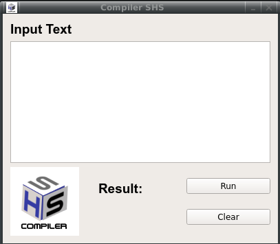

# Proyecto : Crear un Compilador

## Objetivo:
- Crear una interfaz de usuario GUI para el compilador.
- Trabajar en la comunicación del lenguaje C y Python.

### Descripción:
ProyectoCompilador.py, se tiene la GUI.
SSH.y, se encuentra el compilador.
SSH.tab.c, generado al ejecutar con el comando bison para luego ejecutarlo
SSH.output, se encuentra **shift Reduce parse**
CPy.txt, Se guardan la ultima modificación cuando se ejecuta el Botón Run en la Interfaz - Historial.

### Requerimientos:
- Instalar la libreria PyQt5
```sh
# > python3 -m pip install PyQt5
```
- Instalar el analizador sintáctico - bison
```sh
# > apt-get install bison
```
### Pasos:

Se ejecuta el archivo **SSH.y**
```sh
# > bison SSH.y
```
Generará un archivo **SSH.tab.c**, acontinuación se compila el archivo para que genere el **./a.out**
```sh
# > gcc SSH.tab.c
```
Para obtener el _Shift Reduce_ se debe ejecuto lo siguiente, y se obtuvo el archivo **SSH.output**
```sh
# > bison -v SSH.y
```
Tener en cuenta que el ./a.out es muy importante para comunicarse con el lenguaje python ya que es un archivo binario.

```sh
# > python ProyectoCompilador.py
```


